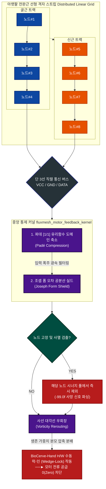

# 🧬 fluxmesh-cybernetics-kernel (Full Loss Standard Software Core v2.5)

본 소프트웨어 커널은 손 전체가 소실(손목 또는 전완부 절단)된 환자를 위해 설계된 **선형 격자형 스마트 스킨(Distributed Linear Grid) 기반 분산형 제어 커널**입니다. 

중앙 메인보드가 모든 연산과 노이즈 필터링을 독박으로 처리하던 기존 의수의 중앙 집중형 구조를 파괴하고, 아랫팔 근육 결을 따라 전개된 말초 노드 칩(1칩 1코드 에지 엔진)들이 1차 정제한 데이터를 직렬 통신 버스로 취합하여 **초저발열·초고정밀 5지 독립 구동**을 달성합니다.

---

## 🗺️ 데이터 파이프라인 아키텍처 (System Topology)

---

## 🔬 4대 핵심 소프트웨어 매커니즘 (Core Logic)

### 1. 1칩 1코드 자율 세포 사멸 (Local Node Apoptosis)
말초단 격자 노드 칩(`biocerve_node_grid.h`) 내부에서 직접 아날로그 전압 신호의 무결성을 검증합니다. 단선, 쇼트, 땀 유입으로 인한 **NaN(Not a Number)** 오염 발생 시 연속 스트라이크 카운터(`NODE_STRIKE_MAX`)가 작동하여 스스로 사멸을 집행하고 중앙 보스 보드에 `-99.0f` 거부 신호를 브로드캐스팅하여 오염원 확산을 원천 차단합니다.

### 2. 사선 대각선 우회장의 발현 (Vorticity Reroute)
특정 손가락이나 센서 노드가 물체에 걸려 사멸 판정을 받으면, 중앙 커널의 실시간 협응 풀 분모(`alive_synergy_pool`)가 동적으로 축소됩니다. 이 과정에서 미분 연산 없이 제어 지분(`dynamic_allocation`)이 남은 정상 손가락 노드로 사선 우회하여 집중되므로, 복잡한 패턴 인식 AI 없이도 물체 모양에 맞춰 손가락들이 스스로 감싸 쥐는 물리적 순응성(Compliance)이 수학적으로 완성됩니다.

### 3. 파데 유리함수 도메인 압축 (Padé Rational Compressor)
자이로 센서 노이즈, 급격한 근육 수축 전위 폭주가 발생하더라도 초월함수(`exp()`) 연산 없이 `dy / (1.0f + abs(dy))` 수식을 통과시키며 언제나 `-1.0f`에서 `1.0f` 사이의 완만한 가속 곡선으로 신호를 압축 마감합니다. 임베디드 레지스터 단에서 최단 클럭으로 연산되어 MCU 점유율을 0.1% 미만으로 억제합니다.

### 4. 조셉 폼 수치 해석 안전 실드 (Joseph Form Covariance Shield)
소수점 연산 장치(FPU)가 없는 저가형 마이크로컨트롤러 환경에서 부동소수점 반올림 오차로 인해 필터 공분산 수치가 음수(Negative)로 떨어져 필터 전체가 폭주하는 현상을 막기 위해, 사칙연산 중심의 **Joseph Form 변형 대칭 수식**을 심어 필터의 기계적·수학적 안정성을 영구 보존합니다.

---

## ⚠️ 컴파일러 최적화 옵션 규정 (Strict Compilation Rule)

본 소프트웨어 커널은 수학적 무결성과 예외 가드(NaN Checking)에 극단적으로 의존합니다. 

- **허용 옵션**: `-O2`, `-O3` (네이티브 FPU 레지스터 및 조건부 이동 명령어 최적화 가동)
- **💥 절대 금지 옵션**: `-Ofast`, `-ffast-math`
  - *이유*: 해당 플래그를 활성화할 경우, 컴파일러가 엄격한 IEEE 754 표준을 무시하고 연산 속도를 올리기 위해 코드 내의 핵심 보루인 **`if (dy != dy)`(NaN 체크 코드) 및 격리벽 연산을 '실행되지 않는 무효 코드(Dead Code)'로 판단하여 무단 삭제(DCE)**해 버립니다. 이는 필터 폭주 시 시스템 마비를 초래하므로 절대 금지를 빌드 규칙으로 강제합니다.

---

## 📂 파일 구성 가이드 (Source Manifest)

- `fluxmesh_motor_feedback_kernel.h`: 1차 자가 치유 루프와 3차 분산 버스 파싱 레이어가 결합한 핵심 통제 헤더.
- `fluxmesh_integrated_prototype.cpp`: 선형 격자 버스로부터 1ms 주기로 데이터를 쿼리해 5지 모터 PWM으로 매핑하는 통합 시뮬레이션 코드.
