# 🧬 fluxmesh-cybernetics-kernel
> **Full Loss Standard Software Core v3.0**

본 소프트웨어 커널은 손 전체가 소실(손목 또는 전완부 절단)된 환자를 위해 설계된 **선형 격자형 스마트 스킨(Distributed Linear Grid)** 및 **햅틱 반사 촉각 신경망 기반 분산형 제어 커널**입니다.

중앙 메인보드가 모든 연산과 노이즈 필터링을 독박으로 처리하던 기존 의수의 중앙 집중형 구조를 파괴하고, 아랫팔 근육 결을 따라 전개된 말초 노드 칩(1칩 1코드 에지 엔진)들이 1차 정제한 데이터를 직렬 통신 버스로 취합하여 **초저발열·초고정밀 5지 독립 구동**을 달성합니다. 

v3.0 업그레이드를 통해 생체 모방 제어 시퀀스와 양방향 햅틱 촉각 신경망, 하드웨어 공차 제어 플래그가 완벽하게 통합되었습니다.

<br>

## 🗺️ 데이터 파이프라인 아키텍처 (System Topology)

```mermaid
graph TD
    %% 노드 정의
    subgraph Grid [아랫팔 전완근 선형 격자 스트립 Distributed Linear Grid]
        A1[🔴 굴근 트랙 노드#1~#4]
        A2[🟠 신근 트랙 노드#5~#8]
    end

    B[단 3선 직렬 버스]
    C[중앙 통제 커널 v3.0]
    
    subgraph Control [동적 시퀀스 제어]
        D[동적 시퀀스 제어]
        E1{"체크: 네 손가락 진행도 >= 60%?"}
        E2{"체크: 최초 물체 접촉?"}
        
        F1[엄지 가동 허용]
        F2[엄지 구동 대기]
        G1[50ms 햅틱 펄스 방출]
        G2[진동 대기]
    end

    H{"하드웨어 인버트 분기 가드<br>#if MOTOR_DIRECTION_INVERT == 1"}
    I1[PWM 역대칭 매핑 출력]
    I2[PWM 정방향 매핑 출력]
    
    J[12비트 극상 정밀도 출력<br>Teensy 하드웨어 타이머 레지스터]
    K[BioCerve-Hand H/W 수동 락-인<br>Wedge-Lock & 실리콘 스킨 복원]

    %% 연결 관계
    A1 --> B
    A2 --> B
    B -->|데이터 취합| C
    C -->|파데 도메인 압축 & Joseph 실드| D
    
    D --> E1
    D --> E2
    
    E1 -->|YES| F1
    E1 -->|NO| F2
    E2 -->|YES| G1
    E2 -->|NO| G2
    
    F1 --> H
    F2 --> H
    G1 --> H
    G2 --> H
    
    H -->|YES| I1
    H -->|NO| I2
    
    I1 --> J
    I2 --> J
    J --> K

    %% 스타일링
    style C fill:#1f232a,stroke:#58a6ff,stroke-width:2px
    style J fill:#1f232a,stroke:#bc8cff,stroke-width:2px
    style K fill:#161b22,stroke:#238636,stroke-width:2px
    style A1 fill:#3e1c1c,stroke:#f85149
    style A2 fill:#3b2d11,stroke:#d29922
```



<br>

## ✨ 핵심 메커니즘 (Key Features)

1. **분산형 에지 컴퓨팅 (1칩 1코드 에지 엔진)**
   * 전완근 스트립에 배치된 각 노드가 로우(Raw) 생체 신호를 실시간 독립 필터링합니다.
   * 메인 MCU의 연산 부하를 80% 이상 경감하여 발열을 억제하고 배터리 효율을 극대화합니다.
2. **동적 무지(Thumb) 연동 시퀀스**
   * 나머지 네 손가락의 굴곡 진행도가 **60% 이상** 도달했을 때만 엄지 구동을 승인하여 자연스러운 파지(Grip) 형태를 구현합니다.
3. **양방향 햅틱 피드백 루프**
   * 물체 접촉 순간을 즉각 감지하여 말초 신경 감각 유도를 위한 **50ms 햅틱 반사 펄스**를 역방향 방출합니다.
4. **하드웨어 레벨 정밀 제어**
   * `#if MOTOR_DIRECTION_INVERT` 컴파일 플래그를 통한 역대칭 PWM 매핑을 지원합니다.
   * Teensy 하드웨어 타이머 레지스터 기반의 **12비트 극상 정밀도** 인터럽트 제어로 오차 없는 구동을 보장합니다.

<br>

## 🛠️ 요구 사항 (Specifications)
* **Target MCU:** Teensy 4.0 / 4.1 (하드웨어 타이머 레지스터 접근 필수)
* **Bus Architecture:** Custom 3-Wire Serial Bus
* **End-Effector Compatibility:** BioCerve-Hand (Wedge-Lock & 실리콘 복원 메커니즘 탑재 모델)


---

## 🔬 7대 핵심 소프트웨어 매커니즘 (Core Logic)

본 커널은 중앙 집중형 연산의 한계를 극복하고 생체 모방 제어의 무결성을 확보하기 위해 다음 6가지 핵심 소프트웨어 아키텍처를 구현합니다. (현재 7번째 알고리즘은 커널 확장 베이스로 대기 중입니다.)

### 1. 1칩 1코드 자율 세포 사멸 (Local Node Apoptosis)
* **신호 무결성 자체 검증:** 말초 노드 칩(Edge Node) 내부에서 수집되는 생체 신호의 유효성을 실시간으로 자가 검증합니다.
* **오염 차단 메커니즘:** 시스템 노이즈 및 하드웨어 결함으로 인해 `NaN` 데이터가 지속해서 발생할 경우, **연속 스트라이크 카운터**가 작동하여 해당 노드를 네트워크에서 자율 사멸(Isolate) 시킵니다.
* **브로드캐스팅 예외 처리:** 사멸된 노드는 즉시 고유 에러 플래그인 `-99.0f`를 직렬 버스에 브로드캐스팅하여 중앙 통제 커널 및 다른 노드로의 데이터 오염 확산을 완벽히 차단합니다.

### 2. 사선 대각선 우회장의 발현 (Vorticity Reroute)
* **결함 허용 아키텍처 (Fault-Tolerant):** 특정 에지 노드가 사멸하더라도 시스템 전체가 다운되지 않고, 생존한 정상 노드들을 중심으로 `alive_synergy_pool`을 즉각 재구성합니다.
* **무연산 물리적 순응성 (Compliance):** 복잡하고 무거운 AI 인추론 레이어 없이도, 가용한 근육 트랙 신호의 조합만으로 물체 형상에 맞추어 유연하게 감싸 쥐는 자연스러운 적응형 파지를 실현합니다.

### 3. 파데 유리함수 도메인 압축 (Padé Rational Compressor)
* **초경량 노이즈 정제:** 전완근 움직임 시 발생하는 극심한 자이로(Gyro) 노이즈 환경에서도 급격한 오버슈트를 제어하기 위해 **파데 근사 유리함수(Padé Approximant)** 알고리즘을 탑재했습니다.
* **고속 도메인 매핑:** 초당 수천 번의 인터럽트 루프 내에서 삼각함수나 지수함수 대비 연산 단가가 극도로 낮은 유리함수를 통해 제어 신호를 `-1.0f ~ 1.0f` 범위로 정제 및 매핑함으로써 MCU의 연산 오버헤드를 최소화합니다.

### 4. 조셉 폼 수치 해석 안전 실드 (Joseph Form Covariance Shield)
* **소수점 누적 오차 방지:** FPU(부동소수점 연산 장치) 하드웨어가 약하거나 미지원되는 극한의 서브 MCU 환경에서도 상태 추정 필터의 공분산 행렬이 비정직행렬(Non-positive definite)로 발산하는 것을 막습니다.
* **수학적 안정성 확보:** 대칭성과 정화선성을 보장하는 **Joseph Form 방정식** 기반 수치해석 실드를 전개하여, 장시간 구동 시 발생하는 기계적·수학적 제어 오차를 완전히 상쇄합니다.

### 5. 지능형 엄지 지연 구동 시퀀스 (Delayed Thumbing) 🌟
* **생체 모방적 파지 알고리즘:** 물체를 쥘 때 5지가 동시에 구동되면 물체가 손바닥 밖으로 밀려 나가는 '물체 방출 현상(Ejection Effect)'이 발생합니다.
* **트리거 조건:** 이를 방지하기 위해 선행하는 네 손가락의 굴곡 진행도가 센서를 통해 **60% 이상** 도달한 시점을 커널이 포착한 후, 최종적으로 엄지(Thumb) 모터에 구동 명령을 하강합니다.

### 6. 반사형 햅틱 촉각 신경망 (Haptic Reflex Feedback) 🌟
* **말초 신경 감각 유도:** 구동 모터의 전류 센서가 사전에 정의된 물리적 접촉 임계치(Contact Threshold)를 감지하는 즉시, 사용자 스킨 인터페이스로 **50ms 햅틱 반사 펄스**를 1회 순간 방출합니다.
* **하드웨어 보호 및 인지:** 사용자는 대뇌 피질의 인지 과정을 거치지 않고도 물건에 손이 닿았음을 직관적으로 반사 인지하게 되며, 이는 무리한 악력 지속으로 인한 구동계 모터의 과열 및 손상을 예방합니다.

---

## ⚠️ 컴파일러 최적화 옵션 규정 (Strict Compilation Rule)

본 소프트웨어 커널은 수학적 무결성과 예외 가드(NaN Checking)에 극단적으로 의존합니다. 

- **허용 옵션**: `-O2`, `-O3` (네이티브 FPU 레지스터 및 조건부 이동 명령어 최적화 가동)
- **💥 절대 금지 옵션**: `-Ofast`, `-ffast-math`
  - *이유*: 해당 플래그를 활성화할 경우, 컴파일러가 엄격한 IEEE 754 표준을 무시하고 연산 속도를 올리기 위해 코드 내의 핵심 보루인 **`if (dy != dy)`(NaN 체크 코드) 및 격리벽 연산을 '실행되지 않는 무효 코드(Dead Code)'로 판단하여 무단 삭제(DCE)**해 버립니다. 이는 필터 폭주 시 시스템 마비를 초래하므로 절대 금지를 빌드 규칙으로 강제합니다.

---

## 📂 파일 구성 가이드 (Source Manifest)

본 커널은 임베디드 런타임과 고성능 수치해석 실드가 결합한 소스 엔진으로, v3.0 최종 업데이트를 통해 다음 핵심 파일들로 통합 관리됩니다.

### 📄 `fluxmesh_motor_feedback_kernel_v2.h`
* **역할:** 최종 제어 마스터 헤더 파일 (Control Master Header)
* **주요 아키텍처 및 구현체:**
  * **자율 치유 루프 통합:** 1차 노드 사멸 및 우회장(`Vorticity Reroute`) 레이어 상단에 탑재되어 작동합니다.
  * **지능형 엄지 지연 구동 스캔 필터:** 네 손가락 진행도 60% 가드를 정밀 필터링하는 `Delayed Thumbing` 알고리즘이 내장되어 있습니다.
  * **논-블로킹(Non-blocking) 햅틱 신경망:** 최초 물체 접촉 순간 시스템 딜레이 없이 50ms 동안 동작하는 촉각 반사 피드백 로직을 구동합니다.
  * **하드웨어 인버트 가드(Invert Guard):** 하드웨어 가공 및 조립 과정에서 발생할 수 있는 모터 회전 방향 공차를 컴파일 레벨에서 실시간 극복 및 보정합니다.

### 📄 `fluxmesh_integrated_prototype_v2.cpp`
* **역할:** 크로스 플랫폼 융합 메인 척수 파이프라인 (Cross-Platform Pipeline Source)
* **주요 아키텍처 및 구현체:**
  * **다채널 전위 데이터 정제:** 아랫팔 전완부 8채널 선형 그리드 격차 전위 신호와 자이로 회전 관성 데이터를 통합 수신합니다.
  * **수치해석 실드 내장:** 고속 자이로 노이즈와 발산 수치를 `Joseph Form` 공분산 가드로 감싸 물리적 오작동을 원천 차단합니다.
  * **크로스 플랫폼 라이프사이클 엔진:** 단일 소스코드로 PC 시뮬레이션 인터페이스 검증 환경과 실제 하드웨어(`Teensy 4.0` / 아두이노 임베디드 런타임)의 `setup()`/`loop()` 라이프사이클 환경을 자동으로 감지하고 전환을 지원합니다.

---

## 🔌 실전 메카트로닉스 하드웨어 배선 명세 (Hardware Topology)

본 시스템은 모터가 물건을 강하게 움켜쥘 때 발생하는 대전류(Peak 3A ~ 4A)가 제어 보드로 역류하여 MCU가 다운되거나 파손되는 병목을 원천 차단하기 위해 **[제어 로직 전원]**과 **[모터 구동 전원]**을 완전히 분리(Isolation)하여 설계합니다.

###  전원 분리 구조 (Power Split Architecture)

```mermaid
graph TD
    %% 배터리 및 전원 노드
    BAT[🔋 Li-Po 2S Battery <br> 7.4V ]
    
    %% 제어계 파이프라인
    subgraph Control_System [제어계 전원 라인 Logic Power]
        REG_MCU[MCU VIN 핀 입력 <br> Teensy 4.0 / ESP32]
        LDO[내장 LDO 레큘레이터]
        SENS_HAP[EMG 센서 및 햅틱 모터 구동 <br> 3.3V / 5V]
    end

    %% 구동계 파이프라인
    subgraph Drive_System [구동계 전원 라인 Motor Power]
        UBEC[고전류 UBEC 모듈 <br> 5V~6V, 5A 출력]
        PCA[PCA9685 외부 터미널 단자]
        MOTORS[5지 독립 서보 모터 구동 <br> MG90S 5개]
    end

    %% 연결 관계
    BAT -->|제어계 분기| REG_MCU
    REG_MCU --> LDO
    LDO --> SENS_HAP

    BAT -->|구동계 분기| UBEC
    UBEC -->|독립 고전류 공급| PCA
    PCA -->|1:1 직결 출력| MOTORS

    %% 공통 그라운드 결선 (핵심 강조)
    REG_MCU -.->|⚠️ 필수 연결: 두꺼운 도선| COMMON_GND((시스템 공통 GND))
    PCA -.->|기준 전위 동기화| COMMON_GND

    %% 스타일 및 컬러링
    style BAT fill:#1f232a,stroke:#d29922,stroke-width:2px
    style REG_MCU fill:#1c2d3d,stroke:#58a6ff
    style UBEC fill:#263c2e,stroke:#3fb950
    style COMMON_GND fill:#3a1d1d,stroke:#f85149,stroke-width:2px
```



---

#### 🛠️ 조립 회로 결선 가이드
1. **베이스(Base) 가드 조립:** MCU `Digital Pin 5` 신호선에 `1kΩ` 보호 저항을 직렬 결선한 뒤, `2N2222` 트랜지스터의 **Base**에 입력합니다.
2. **모터 음극 처리:** 진동 모터의 `(-)` 음극 전선을 트랜지스터의 **Collector(콜렉터)**에 물립니다.
3. **그라운드 공유:** 트랜지스터의 **Emitter(에미터)** 라인은 시스템 공통 그라운드(`GND`)에 직결합니다.
4. **전원 공급:** 진동 모터의 `(+)` 양극 전선은 제어 보드의 `5V OUT` 핀에 직접 연결하여 전원을 공급받습니다.
5. **최종 스위칭 가드:** 진동 모터의 `(+)`선과 `(-)`선 양단에 `1N4148` 스위칭 다이오드를 **역방향(띠가 있는 캐소드가 5V OUT 방향을 바라보도록)**으로 묶어 병렬 납땜합니다. 
   * *효과: 모터가 멈출 때 발생하는 고전압 전압 역류 노이즈가 다이오드를 통해 바이패스(Bypass)되어 보드를 영구 보호합니다.*
  
---

## 🔌 상세 핀 매핑 및 실전 조립 가이드 (Hardware Mapping)

본 섹션은 메인 제어 보드, 드라이버, 서보 모터 및 생체 센서 간의 상호 연결 명세입니다. 하드웨어 조립 및 디버깅 시 참조하십시오.

### 5-2. 상세 핀 매핑 맵 (Pin-to-Pin Mapping Table)

#### A. 메인 제어 보드 ↔ PCA9685 드라이버 (I2C 통신)

| 제어 보드 핀 <br>(Teensy 4.0 / ESP32) | PCA9685 드라이버 핀 | 신호 유형 | 비고 / 설명 |
| :--- | :--- | :--- | :--- |
| **3.3V 또는 5V OUT** | **VCC** | 로직 전원 | 드라이버 칩셋 구동용 전원 |
| **GND** | **GND** | 그라운드 | **공통 그라운드 (Common GND) 필수 결선** |
| **Pin 19 / GPIO 22** | **SCL** | I2C 클럭 | 모터 제어 신호 버스 경로 |
| **Pin 18 / GPIO 21** | **SDA** | I2C 데이터 | 모터 제어 데이터 버스 경로 |

#### B. PCA9685 드라이버 ↔ 마이크로 메탈 서보 모터 (5개 독립 매핑)
> ⚠️ **배선 방향 주의:** PCA9685의 각 채널 서보 플러그에 모터 커넥터를 `[ 갈색/검은색 = GND, 빨간색 = VCC, 황색/주황색 = PWM ]` 방향에 맞춰 직결하십시오.

| PCA9685 출력 채널 | 매핑 손가락 | 소스코드 매핑 번호 | 물리적 제어 타겟 |
| :---: | :--- | :--- | :--- |
| **Channel 0** | 엄지손가락 (Thumb) | `FIN_THUMB = 0` | 손목축 기준 15° 편향 / 지연 구동축 |
| **Channel 1** | 검지손가락 (Index) | `FIN_INDEX = 1` | 30° ~ 45° 아치 기단부 좌측축 |
| **Channel 2** | 중지손가락 (Middle) | `FIN_MIDDLE = 2` | 아치 구조 정중앙 기준축 |
| **Channel 3** | 약지손가락 (Ring) | `FIN_RING = 3` | 아치 구조 우측 순응축 |
| **Channel 4** | 새끼손가락 (Pinky) | `FIN_PINKY = 4` | 15° 안쪽 말림 기단부 우측축 |

#### C. 근전도 센서 & 햅틱 반사 신호 (MCU 직접 제어)

| 주변 장치 파트 | 제어 보드 연결 핀 <br>(Teensy / ESP32) | 신호 유형 | 설명 / 트러블슈팅 가이드 |
| :--- | :--- | :--- | :--- |
| **MyoWare 근전도 센서** | Analog Pin `A0` / `GPIO 36` | Analog INPUT | 전완근 생체 신호 수신 (0 ~ 3.3V 스케일링) |
| **초소형 햅틱 진동 모터** | Digital Pin `5` / `GPIO 12` | Digital OUTPUT | 물체 파지(과부하) 감지 시 50ms 펄스 출력 |

---

### 🛡️ 햅틱 진동 모터 연결 시 주의점 (역기전력 방지 회로)

초소형 동전형 진동 모터(ERM)는 내부 코일이 회전하면서 보드로 강력한 **역기전력(Reverse Voltage)** 전기 노이즈를 뿜어냅니다. MCU의 파손을 막기 위해 핀 직결을 금지하며, 아래 명세에 따라 **NPN 트랜지스터(2N2222 등)**와 **다이오드(1N4148)** 보호 회로를 거쳐 배선해야 합니다.

```text
[MCU Digital Pin 5] ──► [ 1kΩ 저항 ] ──► [ 트랜지스터 Base 핀 ]
[진동 모터 (-)선]    ──► [ 트랜지스터 Collector 핀 ]
[트랜지스터 Emitter] ──► [ 시스템 공통 GND ]
[진동 모터 (+)선]    ──► [ 메인 제어 보드 5V OUT 핀 ]
```
* **💡 최종 가드 패치:** 진동 모터의 `(+)`선과 `(-)`선 양단에 `1N4148` 보호 다이오드를 **역방향으로 나란히 병렬 납땜**하십시오. 모터가 멈출 때 생기는 전압 역류 노이즈가 이 다이오드를 통해 바이패스되어 보드가 보호됩니다.

---

### 🛠️ 실전 조립 배선 체크리스트 (Hardware Checklist)

* **📌 전선 굵기 (AWG 스펙 선정)**
  * UBEC에서 나와 PCA9685 외부 터미널로 들어가는 메인 전원 선과 공통 GND 선은 순간 전류가 매우 높습니다.
  * 반드시 전류 허용량이 넉넉한 **AWG 22** 또는 **AWG 24** 전선을 사용해 주십시오. 
  * 이보다 얇은 선을 쓰면 전선 자체 저항으로 인해 전압 강하가 발생하여 모터 힘이 빠집니다.
* **📌 I2C 통신 무결성 확보 (풀업 저항 매립)**
  * Teensy 4.0이나 ESP32 환경에서 강한 파지 구동 중 I2C 통신이 도중에 끊어지는 병목이 발생할 수 있습니다.
  * 이 경우 `SCL ↔ VCC` 사이와 `SDA ↔ VCC` 사이에 각각 **$4.7\text{k}\Omega$ 저항**을 하나씩 풀업(Pull-up)으로 매립해 주십시오. 
  * 노이즈 상황에서도 신호 무결성이 완벽하게 보장됩니다.

