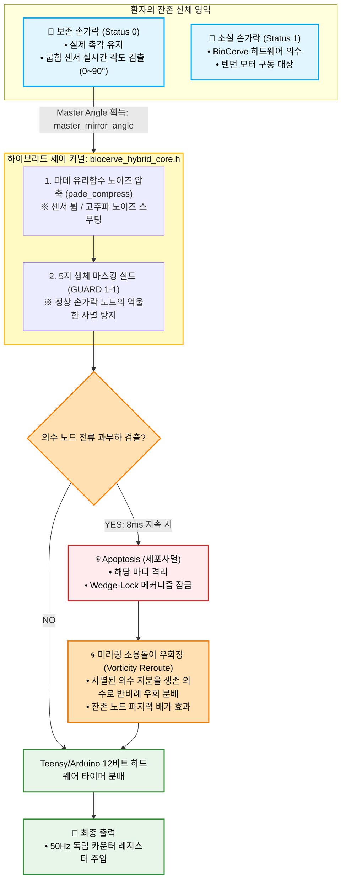

# 👁️ BioCerve-Cybernetics: Hybrid Mirroring Kernel (Partial Loss Software Core v2.5)

본 소프트웨어 커널은 손가락 일부가 소실(부분 절단)되고 일부는 정상 보존된 환자를 위해 설계된 **생체 신호 미러링 및 추적 복사형 사이버네틱스 완전체 커널**입니다. 

기존 전자식 의수처럼 환자가 근육을 인위적으로 튕겨가며 기계 마디를 조작하는 불편함을 멸절하고, 보존된 생체 손가락에 부착된 굽힘 센서(Flex Sensor)의 실제 가동 궤적을 에지 단에서 디지털 압축 파싱하여 **소실된 기계 손가락 의수가 실시간으로 각도를 100% 복사(Mirroring) 동기화 협응**하는 ‘Zero-Learning Curve’ 제어를 완벽히 달성합니다 [INDEX].

나아가, 본 커널은 고부하 행렬 연산을 걷어낸 **Matrix-Free 스칼라 공분산 필터**를 통해 보드 발열을 영(0)으로 억제하며, 계산 완료된 펄스 마이크로초(us)를 **50Hz 독립 하드웨어 타이머 전용 12비트 레졸루션(0~4095 스텝) 수식**으로 정밀 변환 출력하여 기계 마디와 생체의 완벽한 물리적 신경 시냅스를 마감합니다 [INDEX].

---

## 🗺️ 하이브리드 데이터 제어 파이프라인 (System Topology)




---

# 🔬 하이브리드 3대 원천 로직 (Core Software Mechanisms)

### 1. 직관적 생체 미러링 복사 (Biometric Trajectory Mirroring)
* **각도 계산**: 환자가 물건을 잡기 위해 보존된 생체 손가락을 구부림
* **앵커 설정**: 소프트웨어가 실시간 센서 스트림에서 가장 지배적인 가동 각도를 계산하여 `master_mirror_angle`로 상정
* **강제 주입**: 이 앵커 데이터가 소실된 의수 마디의 목표 위치 명령어로 강제 주입
* **동기화**: 환자는 별도의 의수 조작 훈련 없이 원래 내 손을 움직이던 익숙한 신경 신호 그대로 의수와 동기화됨

### 2. 생체 마스킹 세이프 실드 (Biometric Masking Shield)
* **원천 제외**: 환자 프로파일 배열(`finger_status = 0`)에 의해 생체 손가락으로 판정된 구역은 소프트웨어 전류 피드백 스캔 루프에서 마스킹(MASKING) 처리됨
* **노이즈 필터링**: 기계식 액추에이터가 없는 정상 손가락 위치에서 부유 전압 노이즈로 인한 오작동 경보를 차단
* **락업 버그 방지**: 시스템이 오류로 사멸(Apoptosis)하여 전체 인터럽트 루프가 락업되는 현상을 소프트웨어 및 하드웨어 레벨에서 필터링함

### 3. 미러링 우회장과 Wedge-Lock의 크로스 체인 (The Cybernetic Interlock)
* **사멸 격리**: 의수 마디가 접히던 중 장애물에 걸려 모터 코일 전류가 연속 8회(8ms 동안) 임계를 치면 즉시 사멸 격리됨
* **물리 고정**: 그 즉시 하드웨어 코어 v2.5에 설계된 Y축 정렬 차단 턱과 미세 오버행 도피 큐브가 결착(Wedge-Lock)되며, 역하중을 면대면으로 맞물려 지탱하고 모터 전력을 영(0)으로 유도함.
* **사선 우회**: 소프트웨어 시너지 풀 분모(`alive_synergy_pool`)가 압축되며, 미러링 제어 지분이 아직 물체에 닿지 않은 남은 의수 손가락들로 우회(Vorticity Reroute) 집중됨
* **순응성 완성**: 제어 명령이 지터 프리 독립 50Hz 하드웨어 타이머의 12비트 레졸루션(0~4095 스텝) 수식을 거쳐 출력되며, 기계와 생체가 하나의 유기체처럼 물체 모양에 착 감기는 순응성(Compliance)이 완성됨


---

# ⚙️ 환자 개인 맞춤형 셋업 가이드 (Developer & Patient Tuning)

하이브리드 소프트웨어를 환자의 개별 절단 상태에 맞추어 포팅할 때, 개발자는 메인 파일(`biocerve_hybrid_prototype.cpp`)의 초기화 함수 레이어에서 하드웨어 마스킹 레지스터를 다음과 같이 튜닝합니다.

### 1. 하드웨어 마스킹 스위치 조절 (finger_status)
* **1**: 손가락 소실 구역 (BioCerve 의수 텐던 메커니즘 출력 및 12비트 물리 모터 구동 활성화)
* **0**: 생체 존치 구역 (3D 도면 상에 앞쪽 15도 경사형 관통 홀 적용, 의수 출력 생략 및 굽힘 센서 복사 마스터로 대기)

```cpp
// [⚙️ 캘리브레이션 프로파일 매핑]
// 매개변수: (&노드인스턴스, ID, finger_status, 가중치)
biocerve_hybrid_init(&hybrid_fingers[H_THUMB],  H_THUMB,  0, 1.20f); 
biocerve_hybrid_init(&hybrid_fingers[H_INDEX],  H_INDEX,  1, 1.10f); 
// ... 기타 손가락 초기화
```

### 2. 미러링 감도 상수 조정 (Scaling Factor)
* **내용**: 보존된 손가락의 굽힘 센서 편차나 캘리브레이션 상태에 따라 가중치(`float` 값)를 조절함
* **효과**: 미소한 움직임으로도 의수 마디가 기민하게 선형 복사 추적하도록 임베디드 단에서 최종 튜닝

### ⚠ 컴파일러 최적화 옵션 규정 (Strict Compilation Rule)
본 하이브리드 소프트웨어 커널은 수학적 무결성(`IEEE 754 NaN Checking`)에 의존합니다.
* **허용 옵션**: `-O2`, `-O3`
* **💥 절대 금지 옵션**: `-Ofast`, `-ffast-math`
* **금지 이유**: `-Ofast` 플래그는 고속 연산을 위해 NaN 체크 코드를 실행되지 않는 코드(Dead Code)로 간주하여 삭제(DCE)함. 이는 제어 불능(락업)을 유발하므로 빌드 규칙으로 절대 금지함.

### 📂 파일 아키텍처 명세 (Source Manifest)
* **`biocerve_hybrid_core.h`**: 5지 생체 마스킹/미러링 우회장 등 핵심 로직 통합 헤더
* **`biocerve_hybrid_prototype.cpp`**: 1ms 인터럽트 굽힘 센서 데이터를 12비트 물리 모터로 바인딩하는 통합 실행 파일
* **`hardware/biocerve_hybrid.scad`**: 소프트웨어 스위치와 동기화된, 15도 앞쪽 사선형 생체 관통 터널을 구현하는 파라메트릭 CAD 도면

