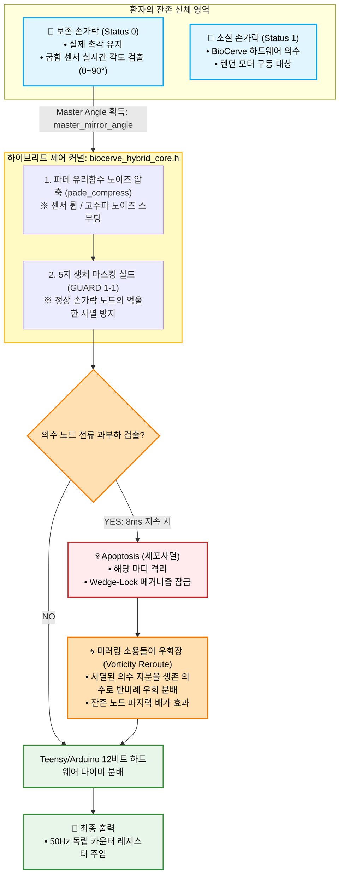

# 👁️ BioCerve-Cybernetics: Hybrid Mirroring Kernel (Partial Loss Software Core v2.5)


본 소프트웨어 커널은 손가락 일부가 소실(부분 절단)되고 일부는 정상 보존된 환자를 위해 설계된 **생체 신호 미러링 및 추적 복사형 사이버네틱스 커널**입니다. 

기존 전자식 의수처럼 환자가 근육을 인위적으로 튕겨가며 기계 마디를 조작하는 불편함을 멸절하고, 보존된 생체 손가락에 부착된 굽힘 센서(Flex Sensor)의 실제 가동 궤적을 낚아채 **소실된 기계 손가락 의수가 실시간으로 각도를 100% 복사(Mirroring)하여 동기화 협응**하는 ‘Zero-Learning Curve’ 제어를 달성합니다.

---

## 🗺️ 하이브리드 데이터 제어 파이프라인 (System Topology)




---

## 🔬 하이브리드 3대 원천 로직 (Core Software Mechanisms)

### 1. 직관적 생체 미러링 복사 (Biometric Trajectory Mirroring)
환자가 물건을 잡기 위해 보존된 생체 손가락을 구부리면, 소프트웨어가 실시간 센서 스트림에서 가장 지배적인 가동 각도를 계산하여 `master_mirror_angle`로 상정합니다. 이 앵커 데이터가 소실된 의수 마디의 목표 위치 명령어로 강제 주입되므로, 환자는 별도의 의수 조작 훈련 없이 **원래 내 손을 움직이던 익숙한 신경 신호 그대로 의수와 동기화**됩니다.

### 2. 생체 마스킹 세이프 실드 (Biometric Masking Shield)
환자 프로파일 배열(`finger_status = 0`)에 의해 생체 손가락으로 판정된 구역은 소프트웨어 전류 피드백 스캔 루프에서 **원천 제외**됩니다. 기계식 액추에이터가 존재하지 않는 정상 손가락 위치에서 전단 노이즈나 부유 전압 때문에 오작동 경보가 발생하거나, 시스템이 억울하게 사멸(Apoptosis)하여 락업되는 버그를 하드웨어 레벨에서 필터링 차단합니다.

### 3. 미러링 우회장과 Wedge-Lock의 크로스 체인 (The Cybernetic Interlock)
미러링 모드로 의수 마디가 생체 손가락을 복사하여 접히던 중, 장애물이나 물체에 걸려 모터 코일 전류가 8ms 임계를 치면 해당 마디는 즉시 사멸 격리됩니다. 
- 그 즉시 하드웨어의 **Wedge-Lock 차단 턱**이 물리적으로 자리를 고정하며 전력을 영(0)으로 유도하고, 
- 소프트웨어 시너지 풀 분모(`alive_synergy_pool`)가 압축되면서 **생체 각도를 복사 추적하는 미러링 제어 지분이 아직 물체에 닿지 않은 남은 의수 손가락들로 사선 우회하여 집중**됩니다. 기계와 생체가 하나의 유기체처럼 물체 모양에 맞춰 착 감기는 순응성(Compliance)이 완성됩니다.

---

## ⚙️ 환자 개인 맞춤형 셋업 가이드 (Developer & Patient Tuning)

하이브리드 소프트웨어를 환자의 개별 절단 상태에 맞추어 포팅할 때, 개발자는 코드 초입부의 프로파일 레지스터를 다음과 같이 튜닝합니다.

### ① 하드웨어 마스킹 스위치 조절 (`finger_status`)
- `1`: 손가락 소실 구역 (BioCerve 의수 텐던 메커니즘 출력 및 모터 구동 활성화)
- `0`: 생체 존치 구역 (손바닥 관통 홀 설계로 의수 출력 생략, 굽힘 센서 복사 마스터로 대기)

```cpp
// [예시] 검지(1)와 중지(2)는 절단 소실되었고, 엄지, 약지, 새끼는 멀쩡히 살아있는 환자 세팅
fingers[FIN_THUMB].finger_status  = 0; // 생체 보존
fingers[FIN_INDEX].finger_status  = 1; // 🤖 의수 구동
fingers[FIN_MIDDLE].finger_status = 1; // 🤖 의수 구동
fingers[FIN_RING].finger_status   = 0; // 생체 보존
fingers[FIN_PINKY].finger_status  = 0; // 생체 보존
```

### ② 미러링 감도 상수 조정 (Scaling Factor)
보존된 손가락의 근육 상태나 센서 캘리브레이션 오차에 따라, 미러링 각도 반영비인 `compressed_mirror * dynamic_allocation * 가중치` 식의 상수값을 조절하여 환자가 가장 적은 힘을 들이고도 의수가 기민하게 추적하도록 임베디드 단에서 튜닝할 수 있습니다.

---

## 📂 파일 아키텍처 명세 (Source Manifest)

- `biocerve_hybrid_core.h`: 5지 생체 마스킹 실드, 대표 궤적 추출 엔진, 그리고 미러링 우회장 수식이 압축 통합된 하이브리드 통제 헤더.
- `biocerve_hybrid.scad`: 위 소프트웨어 프로파일의 `finger_status` 배열과 실시간 동기화되어 15도 앞쪽 사선형 생체 관통 터널을 자동으로 파내는 파라메트릭 3D CAD 도면.
